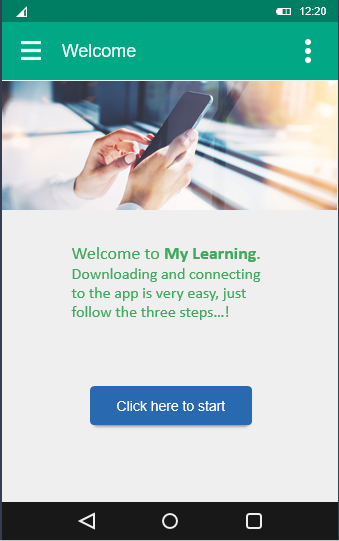
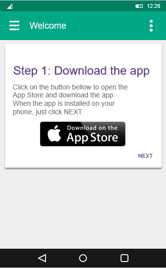
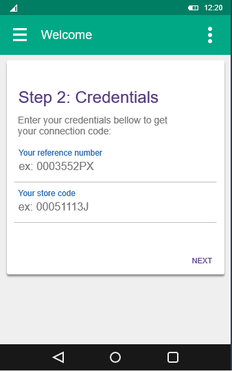
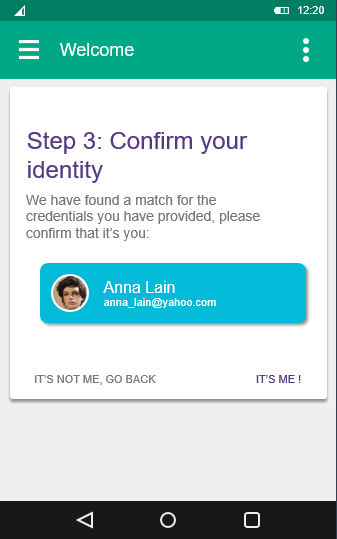
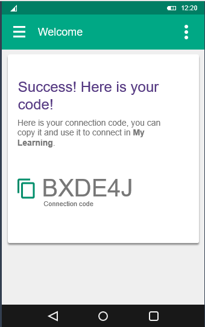
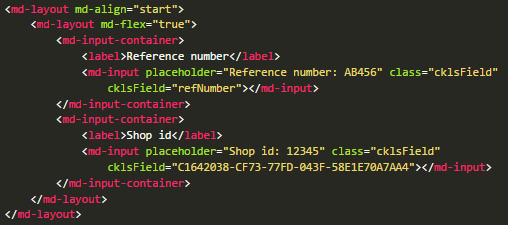

# Mobile smart connect

This project is a sample explaining how you could implement a simplier way to log onto the CrossKnowlesge mobile apps (app Learn and My Learning)

## Flow

* Welcome page

The learner arrives to this page from a link or a QR Code on a poster. The page is only visible inside your organization for security purposes.

* Download

The page show a direct link to download the app for the current device (Android or iOS)

* Credentials

We ask the learner to identify himself. We can use any fields of the learner’s profile that are sufficiently unique to match only one learner: login, email, reference number, store code, etc…

* Identity confirmation

A web service finds the learner, and we ask him to confirm his identity. This step is optional if we use fields that are sufficiently safe (email)

* Code

A second web service gets the code, that can now be used to connect to the app.

## Installation

1. Clone the project and change it to fit your needs (design, logo, color etc ...)
2. Add a file at the root called app.ini, with the following informatin

    CKLS_URL = https://{URL OF YOUR INSTANCE}/API/ADMIN/v1/REST/
    API-KEY = {API Key}

    Ask your IT consultant for this infomation if you do not have it.

3. Change the page **credentials.html** to fit your need on authentication mechanism. Append as many **md-input** as you need
to authentify learner’s

    Adapt the attribute **cklsField** with the name of the actual field in the LMS, or the Guid if it's a custom field
    Please note that the code, as it is, consider all fields mandatory. You can of course change it

## Disclaimer

This code is provided "AS IS", and the [MIT licence](https://opensource.org/licenses/MIT) is applied